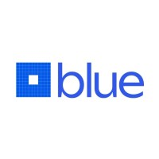
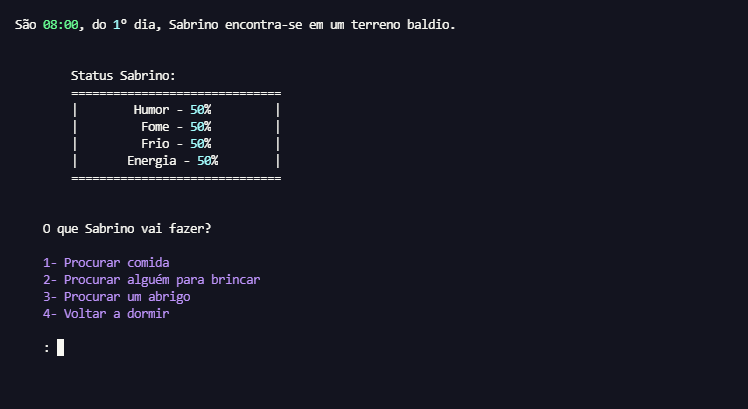

# Projeto 5  Blue EdTech - Vida de Cão 🐶

<p align="center">

</p>

## Inicio do jogo


> Você será um cachorrinho 🐶 de rua, nesta trama seu objetivo é sobreviver e ser adotado enquanto você foge do seu pior vilão... A carrocinha.

## 🔵 Ajustes e melhorias

O projeto ainda está em desenvolvimento e as próximas atualizações serão voltadas nas seguintes tarefas:

- [x] Construção das fases principais
- [x] Criação de efeitos sonoros
- [x] Elementos visuais de cores
- [x] Aumento número de fases
- [x] Mais interatividade
<br></br>

## 💻 Pré-requisitos

Antes de começar, verifique se você atendeu aos seguintes requisitos:
<!---Estes são apenas requisitos de exemplo. Adicionar, duplicar ou remover conforme necessário--->
* Instale a versão mais recente de `Python / bibliotecas: pygame - rich - tqdm / são requeridas`
* Você tem uma máquina `<Windows / Linux / Mac>`.
* Você leu `<guia / link / documentação relacionada ao projeto>` - Completo

<br></br>

## ☕ Usando Projeto 5 - Vida de Cão 🐶

Para usar Projeto 5 - Jogo Interativo, siga estas etapas:

Crie uma pasta desejada, abra o diretorio pelo terminal e digite o comando de git clone:
```
git clone https://github.com/SSilvaGustavo/Projeto5_Blue.git
```
Em seu terminal rode o comando:
```
python3 main.py
```
<br></br>

## 🐶 Regras básicas do jogo Interativo

Você será um cachorrinho de rua, nesta trama seu objetivo é sobreviver e ser adotado enquanto você foge do seu pior vilão...a carrocinha, neste jogo você deverá ficar atento a algumas caracteristicas do cão. 

* <b>Humor</b> - Seu humor é baseado no nivel de sucesso referente as suas escolha, se você tiver sucesso seu nivel de humor é aumenta, senão,
seu nivel de humor sofre alterações, tudo que você faz afeta seu humor.

* <b>Fome</b> - Seu nivel de fome, é atrelado ao seu humor e energia, portanto, tente sempre mantelá nos conformes.

* <b>Frio</b> - Seu nivel de frio, é atrelado ao seu humor, um cachorrinho quente é um cachorro feliz :)

* <b>Energia</b> - Sua energia é seus pontos de ação, todas as suas atividades gastam energia, tente manter sua barriguinha cheia, se sua energia for
zerada, seu dia encerrará automaticamente.

Qualquer outra dúvida referente as regras, entre em contato conosco!

<br></br>

## 📫 Contribuindo para Projeto 5 - Jogo Interativo
<!---Se o seu README for longo ou se você tiver algum processo ou etapas específicas que deseja que os contribuidores sigam, considere a criação de um arquivo CONTRIBUTING.md separado--->
Para contribuir com Projeto 5 - Jogo Interativo, siga estas etapas:

1. Bifurque este repositório.
2. Crie um branch: `git checkout -b <nome_branch>`.
3. Faça suas alterações e confirme-as: `git commit -m '<mensagem_commit>'`
4. Envie para o branch original: `git push origin <nome_do_projeto> / <local>`
5. Crie a solicitação de pull.

Como alternativa, consulte a documentação do GitHub em [como criar uma solicitação pull](https://help.github.com/en/github/collaborating-with-issues-and-pull-requests/creating-a-pull-request).

<br></br>
## 🤝Idealizadores e Colaboradores 

Agradecemos às seguintes pessoas que contribuíram para este projeto:
<table>
  <tr>
    <td align="center">
      <a href="#">
        <br>
        <sub>
        <a href="https://github.com/SSilvaGustavo">
          Gustavo Souza</</a>
        </sub>
      </a>
    </td>
    <td align="center">
      <a href="#">
        <br>
        <sub>
          <a href="https://github.com/NatashaMiyaguti"> Natasha Miyaguti</a>
        </sub>
      </a>
    </td>
    <td align="center">
      <a href="#">
        <br>
        <sub>
          <a href="https://github.com/renanabintes">Renan Abintes</a>
        </sub>
      </a>
    </td>
    <td align="center">
      <a href="#">
        <br>
        <sub>
          <a href="https://github.com/ivancoruja">Ivan Coruja</a>
        </sub>
      </a>
    </td>
    <td align="center">
      <a href="#">
        <br>
        <sub>
          <a href="https://github.com/fharaujo">Fábio Araujo</a>
        </sub>
      </a>
    </td>
    </tr>
</table>

<br></br>

## Não compre, adote! <br> 🐶

Quer conhecer projetos de adoção? Clique [AQUI](https://nfpet.com.br/blog/2019/08/10-ongs-de-animal-para-voce-ajudar/d) e leia como adotar.


[⬆ Voltar ao topo](#)<br>
